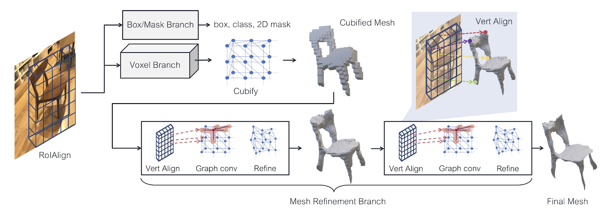

# Mesh R-CNN Playground - Backend

This repository contains a web application for interacting with Mesh R-CNN and our additions to the model. The API has been developed using the FastAPI library.

For more information regarding the original Mesh R-CNN work, visit this [link](https://arxiv.org/abs/1906.02739)

## Usage
### Installing dependencies
To install the dependencies for the application, use the requirements.txt file.

`pip install -r requirements.txt` 

### Running the application

For running the app with hot reload functionality.

`uvicorn api.main:app --reload --host 0.0.0.0`

If you don't need hot reload functionality, then run

`uvicorn api.main:app --host 0.0.0.0`

## Functionality
After cloning this repository and setting up the dependencies propery (with requirements.txt), you are able to interact with the model. The API returns everything with the original Mesh R-CNN model plus more. What gets returned are predictions for bounding box, classification, voxel representation, mesh representation, and textured mesh representations.
